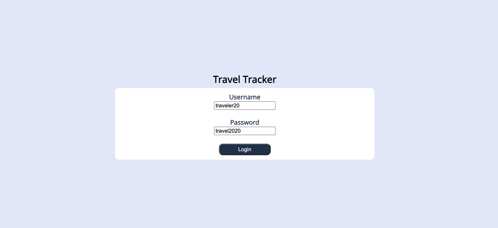
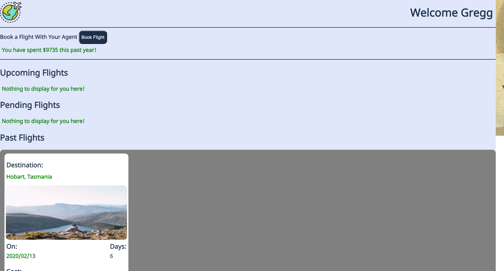
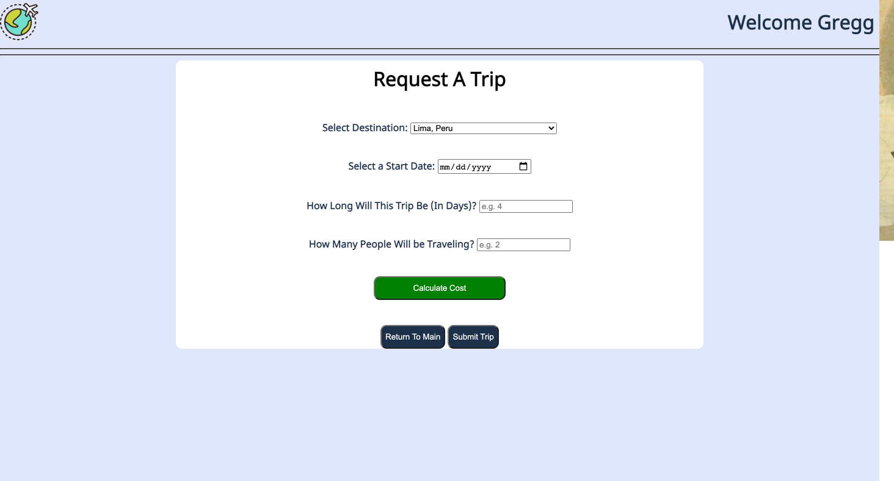
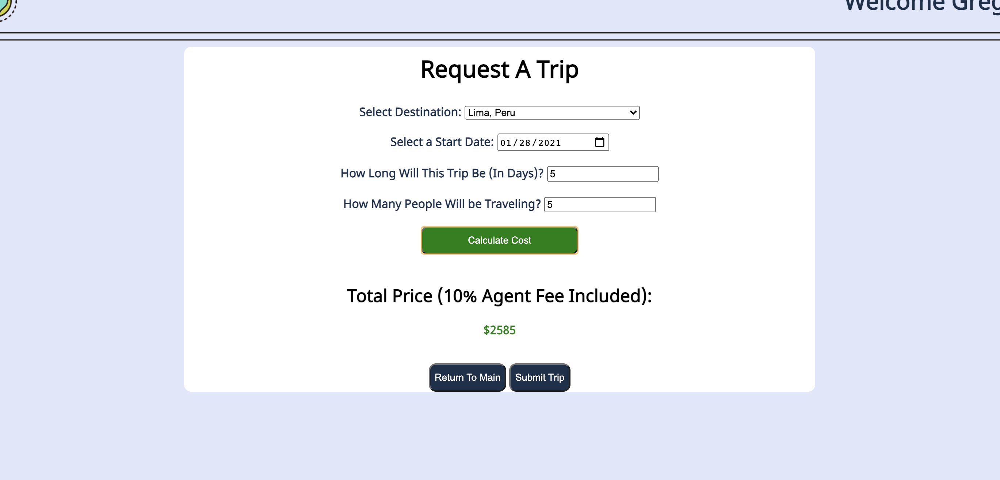
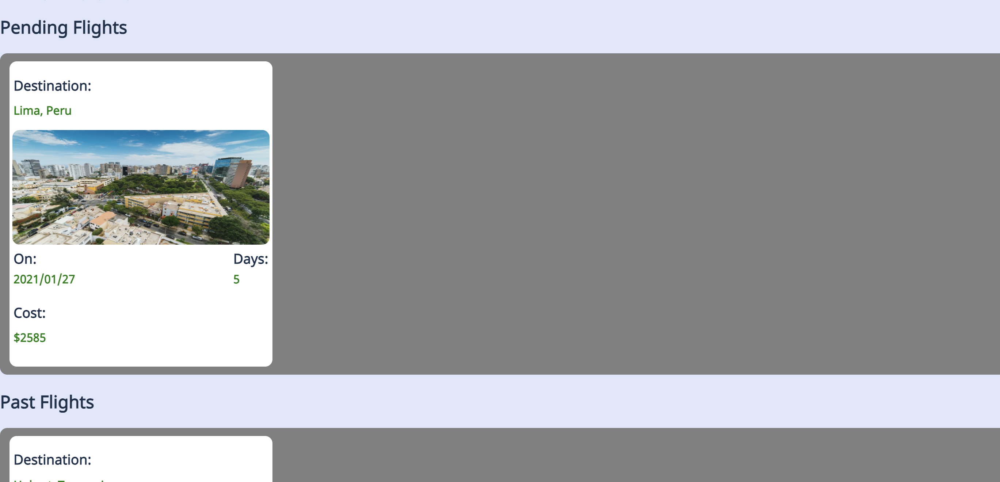

# Travel Tracker
With this project, we were given a basic repo that included a built in webpack to compile our files. Everything else was created. It involved fetch requests to a local server in order to get the data we needed, or to post new data and represent it in a UI/UX friendly manner.

## Usage
Opening the Travel Tracker website will prompt the user to a login page. Here, the user needs to type "travelerXX" (the XX being any number 1-50). Then in the password input, the user needs to type "travel2020". Once done correctly, the user will be brought to the main dashboard where they are welcomed at the top of the screen, and displayed to 3 main sections: an upcoming flights section, a pending flights section, and a past flights section. Inside of each of these will be travel cards that fall under the respective section. These cards display the destination of the trip, an image of the destination, the date the trip started, the duration of the trip in days, and also the cost of the trip. If a user doesn't have any trips that match the criteria for any of the three sections, there will be a message letting them know that there is no information to display.

Login to Dashboard View:

The user can click on the book now located in the header of the page, that will bring you a from where when filled out, you can calculate the cost of your made trip.

Book trip form:

After 'Calculate Cost' button is clicked:

Once the user feels confident that the form is filled out and the trip is what they want, they then can click the submit button which will then take the user back to the dashboard and display their new trip in the pending section.

Dashboard After Submit:  

## How to Install
1. `fork` this repository
2. `git clone` it down to your command line
3. Navigate into the repository on your machine
4. Run `npm install`
5. Run `npm start` to launch local server

To access data api:
1. `git clone` [this]() (add link) repo to your command line
2. Navigate into the repository on your machine
3. Run `npm install`
4. Run `npm start` to launch API server (*both servers need to be running to access the site)

OR

Visit live site [here]() (we will build this live right?)

## Technologies Used
1. JavaScript (vanilla)
2. HTML
3. Sass/SCSS
3. WebPack
4. Chai & Mocha

## Planning
We utilized github projects for project management, that board can be found [here](https://github.com/LukeMason33/refactor-tractor/projects/1)  
The detailed spec for this project can be found [here](https://frontend.turing.io/projects/module-2/refactor-tractor-wc.html)  
The original project spec for the codebase we were provided can be found [here](https://frontend.turing.io/projects/whats-cookin.html).

### Testing development
We expanded upon the testing built into the original code base to check functionality. We adjusted the original tests to utilize new data formatting to match the data from the server.

### Challenges
* This was our first experience receiving a large codebase we were unfamiliar with and needing to work on it. It was certainly a challenge to familiarize ourselves with what the code was doing and it was quite an undertaking to reorganize existing code to improve organization and functionality. Initially we struggled to find a good place to jump in and start refactoring, but eventually decided we should start by determining what within the codebase was already functioning well in terms of JavaScript functionality and User Experience/Interaction. After that, we were better able to plan out how to most efficiently move forward and use our time by dividing and conquering small tasks and communicating openly and frequently about new issues we found, or changes we would like to implement. We ended up having to separate our desired changes into `required` to dos and `desired` to dos (things that would be nice to implement but not our minimum viable product).
* We ran into some resistance when trying to access all info from our network requests simultaneously. After some research we found `Promise.all()` which solved our issues, as it returns all the input network requests together.
* Utilizing Sass/SCSS for the first time was interesting. It took some additional research on syntax and functionality of mixins vs built in color functions. The biggest challenge here was taking messy provided CSS and converting it into SCSS while refactoring and adjusting styling to improve UX.
* Understanding WebPack - It was our first experience with WebPack so we had to do some research and fiddling to get it to work as we expected/wanted it to.

### Wins
* Developing a strong understanding of a foreign codebase and being able to refactor significantly. While this was also one of our major challenges during the project, we were all very proud of our ability to quickly familiarize ourselves with the functionality and therefore refactor effectively.
* Teamwork and dividing up work successfully without any major merge conflicts. We chose to implement a divide and conquer workflow, and because of our clear and frequent communication, we were extremely successful in getting tasks done more quickly. We also took the time to walk through all the changes together to be sure we fully understood all the changes.

## Future Iterations
* Adding Recipes: A user would be able to submit a recipe to the site, and after admin review, it could be approved and added to the recipe database.
* Admin view: Developing an Admin view for the site that could show some User trends and any submitted recipes waiting for review.
* Rating Recipes: After a user has made a recipe they should be prompted to rate the recipe on a few different qualities (maybe difficulty level and approval). These ratings could then be visible to other users.
* Providing the cost of the missing ingredients in order to make a recipe.
* The button to remove items from pantry to only work if conditions are met where the user has enough of each ingredient to make the recipe.

## Project Members
This project was designed and implemented by [Luke Mason](https://github.com/LukeMason33), [Lucas Merchant](https://github.com/lbmerchant93), and [Kristen Bair](https://github.com/kristenmb)#
